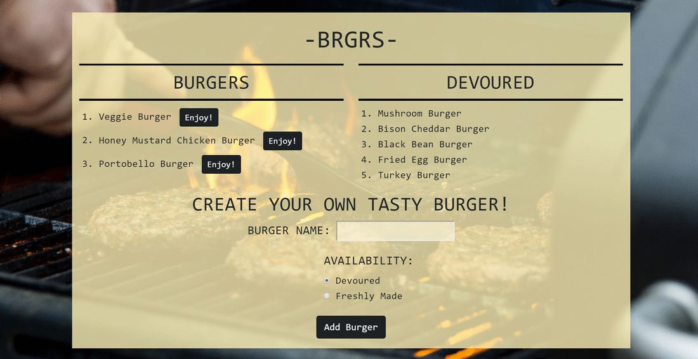

# burger
This is a front end Burger Logger application built with Bootstrap, MySQL, Node, Express, & Handlebars for dynamic responsiveness, utilizing a homemade ORM, and deployed on Heroku.

# How to use
From the BRGR home page, either click the 'Enjoy!' button next to the delicous burger you would like to devour, or enter your own custom burger creation in the input field found below the pre-made offerings.  Each burger you enjoy will be moved from BURGER, to DEVOURED, allowing you to keep track of which burgers you have tried.

### [Try the App!](https://secure-retreat-53732.herokuapp.com/)

Technology: HTML5 | CSS3 | Bootstrap | JavaScript | Jquery | Google Fonts | Express | Node | MySQL | Handlebars | ORM
